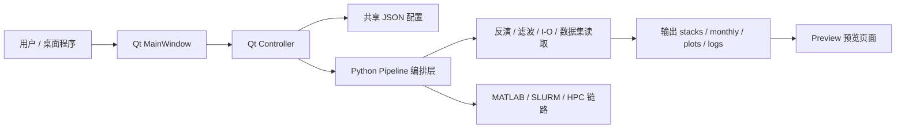
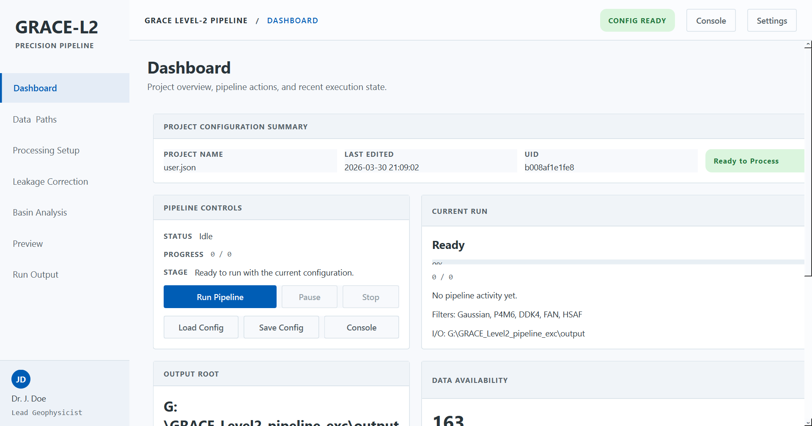
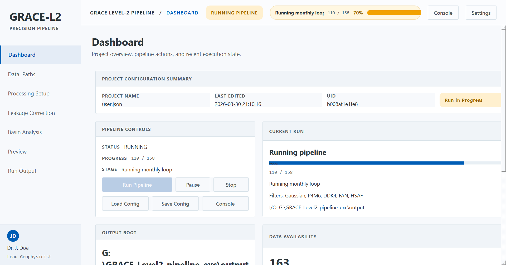
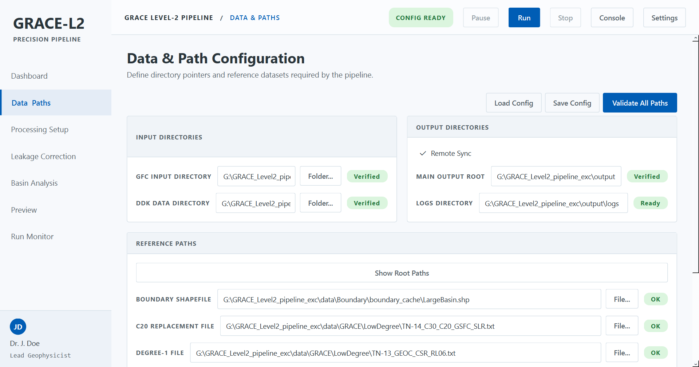
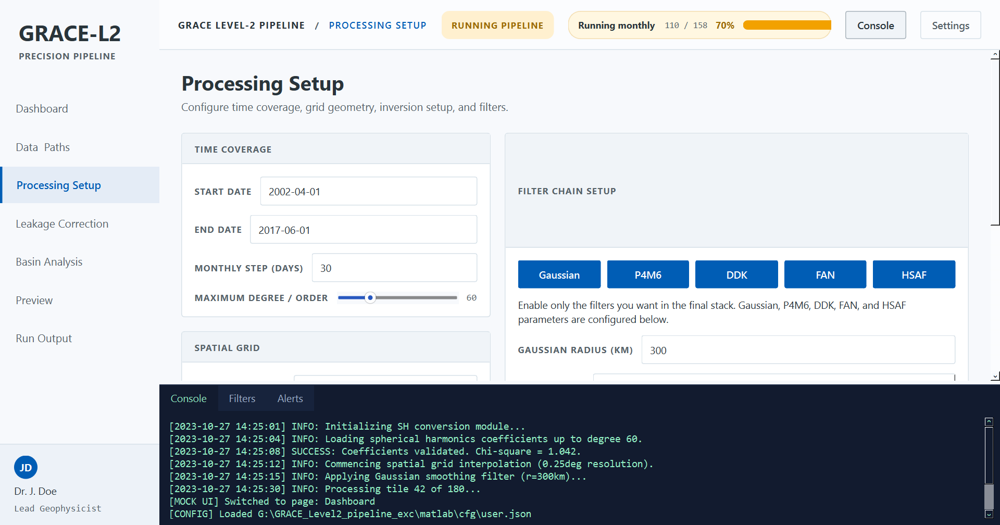
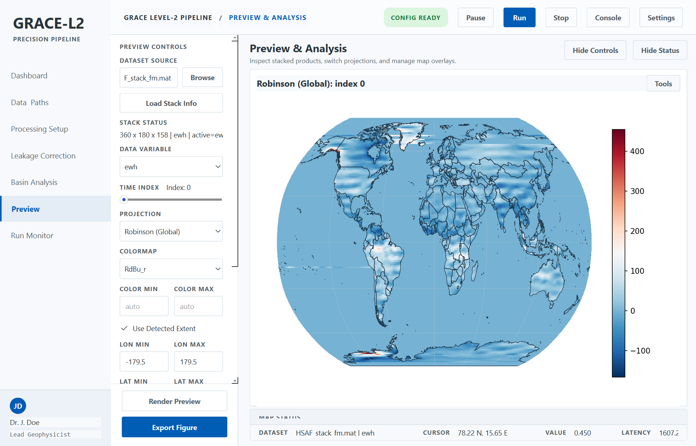

# GRACE Level-2 桌面程序总览文档

## 1. 文档用途

这份文档用于快速说明本仓库中的 `GRACE Level-2 Pipeline` 桌面程序，适合作为：

- 新成员接手项目时的快速导览
- 后续对话继续排查 UI、流程、性能问题时的上下文摘要
- 本地运行、Python 运行、MATLAB 运行、HPC 运行之间的链路说明
- 页面功能、输出目录、配置方式、数据流的统一入口说明

如果后续需要继续开发该程序，优先先看这份文档，再进入对应代码路径。

## 2. 一页式快速预览

### 2.1 程序是什么

这是一个面向 GRACE / GRACE-FO Level-2 数据处理的桌面程序。它以桌面 GUI 作为操作入口，负责配置路径、组织处理参数、启动流程、检查输出、快速预览结果，并可联动本地 Python 处理链或远端 MATLAB + SLURM 的 HPC 运行链路。

### 2.2 核心要点

| 项目 | 内容 |
| --- | --- |
| 桌面可执行文件 | `dist/grace-pipeline-gui.exe` |
| Python GUI 启动入口 | `grace-pipeline gui` |
| Python CLI 运行入口 | `grace-pipeline run -c ../configs/user.json -d ../configs/default.json` |
| MATLAB 本地一键入口 | `matlab/src/main/run_oneclick.m` |
| HPC 提交入口 | `hpc.ps1` |
| 共享配置文件 | `configs/default.json`、`configs/user.json` |
| 本地输出目录 | `outputs/local/` |
| 远端输出目录 | `outputs/remote/<jobid>/` |
| 网格堆栈约定 | `[nLon x nLat x Nt]` |
| HSAF 默认上游输入 | `P4M6` |

### 2.3 推荐使用方式

#### 面向普通使用者

直接运行打包后的 EXE：

```powershell
G:\GRACE_Level2_pipeline_exc\dist\grace-pipeline-gui.exe
```

#### 面向 Python 开发/调试

```powershell
cd G:\GRACE_Level2_pipeline_exc\python
py -m pip install -e ".[gui]"
grace-pipeline gui
```

#### 面向命令行本地处理

```powershell
cd G:\GRACE_Level2_pipeline_exc\python
grace-pipeline run -c ..\configs\user.json -d ..\configs\default.json
```

#### 面向 MATLAB 本地处理

在 MATLAB 中运行：

```matlab
run('G:\GRACE_Level2_pipeline_exc\matlab\src\main\run_oneclick.m')
```

#### 面向远端 HPC

```powershell
cd G:\GRACE_Level2_pipeline_exc
.\hpc.ps1
```

## 3. 仓库结构与运行形态

### 3.1 顶层结构

- `matlab/`
  - MATLAB 配置、处理主链、分析脚本、HPC 提交链路
- `python/`
  - 桌面 UI、CLI、Python 侧流程编排、预览与 I/O
- `data/`
  - 输入数据、参考数据、辅助文件
- `outputs/`
  - 本地与远端运行结果
- `docs/`
  - 文档、报告、说明
- `dist/`
  - 打包后的桌面程序

### 3.2 输出目录约定

该项目明确区分两类运行结果：

- 本地运行输出到 `outputs/local/...`
- HPC 远端运行输出到 `outputs/remote/<jobid>/...`

这样做的目的：

- 避免本地调试结果和远端生产结果混淆
- 让每个远端作业都有自己独立的结果目录
- 便于回溯不同运行批次

## 4. 启动方式

### 4.1 桌面 EXE 启动

适合常规操作与 UI 验证：

```powershell
G:\GRACE_Level2_pipeline_exc\dist\grace-pipeline-gui.exe
```

### 4.2 Python GUI 启动

适合开发与联调：

```powershell
cd G:\GRACE_Level2_pipeline_exc\python
py -m pip install -e ".[gui]"
grace-pipeline gui
```

### 4.3 Python CLI 启动完整流程

适合不打开界面时测试流程：

```powershell
cd G:\GRACE_Level2_pipeline_exc\python
grace-pipeline run -c ..\configs\user.json -d ..\configs\default.json
```

### 4.4 MATLAB 本地启动

适合验证 MATLAB 主流程：

```matlab
run('G:\GRACE_Level2_pipeline_exc\matlab\src\main\run_oneclick.m')
```

### 4.5 远端 HPC 启动

适合大规模或集群运行：

```powershell
cd G:\GRACE_Level2_pipeline_exc
.\hpc.ps1
```

其中：

- 根目录 `hpc.ps1` 会转发到 `matlab/hpc.ps1`
- 远端作业脚本是 `matlab/scripts/run/run.slurm`
- 当前 SLURM 资源请求固定为 `--cpus-per-task=52`

## 5. 运行环境与配置方式

### 5.1 Python 桌面端环境

桌面 GUI 的启动入口是：

- `python/grace_pipeline/ui/qt/app.py`

启动时会完成这些事情：

- 初始化 `QApplication`
- 应用 Qt 主题与全局样式
- 加载 Windows 字体
- 限制本地 BLAS/OpenMP 线程，避免过度抢占 CPU：
  - `OPENBLAS_NUM_THREADS=1`
  - `MKL_NUM_THREADS=1`
  - `NUMEXPR_MAX_THREADS=1`
  - `OMP_NUM_THREADS=1`

### 5.2 配置文件

桌面端与后端流程共用同一套 JSON 配置：

- `configs/default.json`
- `configs/user.json`

主要配置内容包括：

- 输入输出路径
- 时间范围
- 网格设置
- 低阶项替换
- GIA 开关
- 滤波链配置
- HSAF 参数
- 并行设置
- 输出写盘方式

### 5.3 远端 HPC 环境

远端运行路径：

- 提交入口：`hpc.ps1`
- SLURM 脚本：`matlab/scripts/run/run.slurm`（兼容入口，最终转发到 `packaging/hpc/slurm/run_matlab.slurm`）

当前假设：

- 单节点
- 单任务
- `--cpus-per-task=52`
- 使用 MATLAB 2023a 模块
- 结果输出到 `outputs/remote/$SLURM_JOB_ID`

## 6. 前后端链路

### 6.1 总体链路图



### 6.2 前端层

Qt 前端主要代码位于：

- `python/grace_pipeline/ui/qt/main_window.py`
- `python/grace_pipeline/ui/qt/controller.py`
- `python/grace_pipeline/ui/qt/pages.py`
- `python/grace_pipeline/ui/qt/widgets.py`
- `python/grace_pipeline/ui/qt/theme.py`
- `python/grace_pipeline/ui/qt/preferences.py`
- `python/grace_pipeline/ui/qt/i18n.py`

前端职责：

- 页面导航
- 路径设置
- 处理参数设置
- 运行控制
- 状态与进度展示
- 输出摘要
- 预览与导图
- 主题/语言切换

### 6.3 Python 后端

Python 侧核心包结构：

- `app/`
  - 流程编排与执行入口
- `domain/`
  - 科学计算逻辑
- `infra/`
  - 配置、数据集、运行时、stack 读取与 I/O
- `ui/`
  - 桌面界面

典型本地运行链路：

1. 读取共享配置
2. 从 GFC 输入构建时间索引
3. 执行反演与滤波链
4. 将结果写入 `outputs/local/`
5. 将 stacks / monthly / plots 暴露给 Preview 页面使用

### 6.4 MATLAB / HPC 后端

该仓库保留了一条 MATLAB 生产链，用于远端集群运行。

远端链路：

1. 本地启动 `hpc.ps1`
2. 推送代码和配置到远端
3. 提交 `run.slurm`
4. 远端 MATLAB 执行 `run_oneclick.m`
5. `run_oneclick.m` 读取 `cfg` 并执行 `run_pipeline(cfg)`
6. 结果写入 `outputs/remote/<jobid>/`
7. 拉回本地继续检查与预览

## 7. 页面功能说明与截图

### 7.1 Dashboard / 仪表盘

仪表盘是整个软件的运行总览页，也是主要操作入口。



运行时，它会显示实时状态、当前阶段、进度、输出信息。



主要功能：

- 显示当前项目配置摘要
- 显示当前运行状态
- 显示运行阶段与进度
- 显示输出目录与数据可用性
- 汇总输出结构预览
- 提供运行、暂停、停止、控制台、配置相关操作入口

### 7.2 Data Paths / 数据路径

该页面用于组织输入目录、输出目录和参考文件。



主要功能：

- 设置 GFC 输入目录
- 设置 DDK 数据目录
- 设置主输出目录
- 绑定参考文件与辅助文件
- 校验每一项路径是否合法

典型包含：

- GFC 输入目录
- DDK 目录
- Boundary shapefile
- 低阶项文件
- GIA 文件
- Mascon 参考文件

### 7.3 Processing Setup / 处理设置

该页面定义当前任务的主要科学处理逻辑。



建议按 4 块理解：

- `Detected Time Range`
  - 由 GFC 自动检测时间范围
  - 支持手动覆盖
- `Inversion & Corrections`
  - `Lmax`
  - 距平处理选项
  - 低阶项替换
  - GIA 开关
- `Spatial Grid`
  - 经度范围
  - 纬度范围
  - 分辨率
- `Filter Chain`
  - Gaussian
  - P4M6
  - DDK
  - FAN
  - HSAF

这页的目标不是暴露所有底层参数，而是保留与当前项目直接相关、真实生效的处理项。

### 7.4 Preview / 预览与分析

Preview 页面用于对输出产品进行快速检查和导图。



主要功能：

- 按时间索引浏览 stack 产品
- 切换投影
- 设置色带与范围
- 管理海岸线/边界/网格等叠加层
- 渲染并导出图像

性能说明：

- Preview 不应在仅查看单一时间片时强制读取整个 stack
- 对大体积 Mascon 数据，当前设计应优先走按时间片读取

## 8. 典型操作流程

1. 启动桌面程序。
2. 进入 `Data Paths`，校验输入输出和参考文件。
3. 进入 `Processing Setup`，确认时间、改正项、网格和滤波链。
4. 返回 `Dashboard` 启动流程。
5. 在顶部状态区与 Dashboard 中观察进度和阶段。
6. 在 `Preview` 页面检查结果质量。
7. 需要时导图，或继续做流域分析 / 泄漏校正。

## 9. 关键数据与科学约定

### 9.1 时间范围

处理时间范围应优先来自 GFC 目录的真实文件汇总，而不是手工硬编码。
这会影响：

- 实际可处理月份数
- Dashboard 上的总数显示
- 低阶项匹配
- Preview 时间索引

### 9.2 低阶项与改正项

当前桌面程序应支持可选控制以下替换/改正：

- Degree-1 geocenter
- `C20`
- `C30`
- GIA

这些项目应在 `Processing Setup` 中显式可控，而不是默认静默启用。

### 9.3 HSAF

HSAF 相关要求：

- 默认上游输入为 `P4M6`
- 参数来自 JSON 配置
- 输出数据结构保持与程序其他部分兼容
- 不应因为提速而破坏 Preview 所依赖的数据格式

## 10. 输出结构说明

### 10.1 本地输出

典型本地结构：

```text
outputs/local/
├─ logs/
├─ monthly/
├─ plots/
├─ stacks/
└─ ...
```

### 10.2 远端输出

典型远端结构：

```text
outputs/remote/<jobid>/
├─ logs/
├─ monthly/
├─ plots/
├─ stacks/
└─ ...
```

### 10.3 Preview 兼容要求

为了让 Preview 页面稳定读取，stack 数据必须保持：

- 形状为 `[nLon x nLat x Nt]`
- 字段兼容：
  - `ewh`
  - `lon`
  - `lat`
  - `t`
  - `tag`

## 11. 常见排查点

### 11.1 Preview 首次打开特别慢

优先检查：

- 是否错误地整栈加载了大型 netCDF / MAT 数据
- 是否应该改为按单时间片读取
- 是否预览缓存没有命中

### 11.2 本地运行却出现集群式日志

本地正常运行时，Console 不应该过多显示 HPC/探针类信息。
如果出现：

- CPU probe
- configured workers
- frozen / SLURM 类调试日志

通常说明运行时探针日志没有被正确限制在 debug / HPC 场景。

### 11.3 HSAF 极慢

优先排查：

- worker 选择是否合理
- 是否走错了并行路径
- BLAS 线程是否被限制
- 是否写盘路径过慢
- 是否错误地让外层并行和内层并行相互抢占

### 11.4 输出不一致

检查：

- `Data Paths` 中的输入与参考路径
- GFC 时间汇总是否正确
- 低阶项/GIA 开关是否符合预期
- 滤波链顺序是否正确
- 当前是本地输出还是远端输出

## 12. 后续对话的快速上下文

如果后续继续围绕这个软件对话，最低限度需要记住这些事实：

- 它是一个 Qt 桌面前端 + GRACE Level-2 处理后端的混合工程
- 配置中心在 `configs/default.json` 和 `configs/user.json`
- 本地运行通常走 Python 桌面端
- 远端生产运行通常走 MATLAB + SLURM + HPC
- 输出分为 `outputs/local/` 和 `outputs/remote/<jobid>/`
- Preview 依赖 `[nLon x nLat x Nt]` 的 stack 数据结构
- HSAF 默认输入应为 `P4M6`
- 最核心的页面是：
  - Dashboard
  - Data Paths
  - Processing Setup
  - Preview

## 13. 关键代码位置

- GUI 启动入口：`python/grace_pipeline/ui/qt/app.py`
- 主窗口：`python/grace_pipeline/ui/qt/main_window.py`
- Qt 控制器：`python/grace_pipeline/ui/qt/controller.py`
- 页面定义：`python/grace_pipeline/ui/qt/pages.py`
- CLI 入口：`python/grace_pipeline/cli.py`
- Python 架构说明：`python/grace_pipeline/ARCHITECTURE.md`
- MATLAB 本地入口：`matlab/src/main/run_oneclick.m`
- HPC 入口：`hpc.ps1`
- SLURM 脚本：`matlab/scripts/run/run.slurm`
